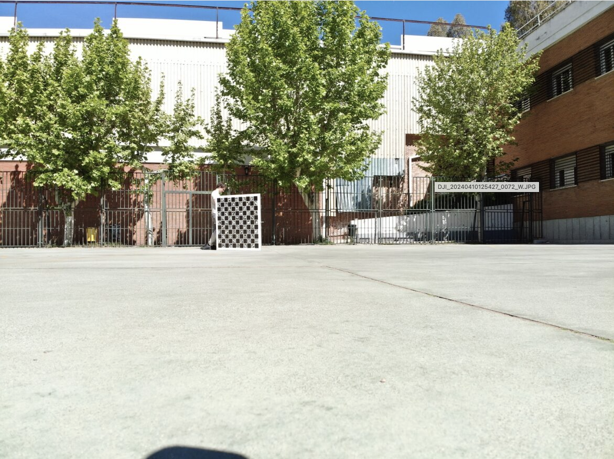
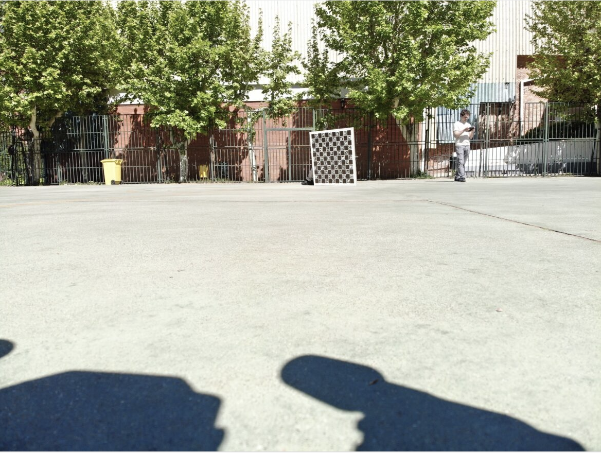
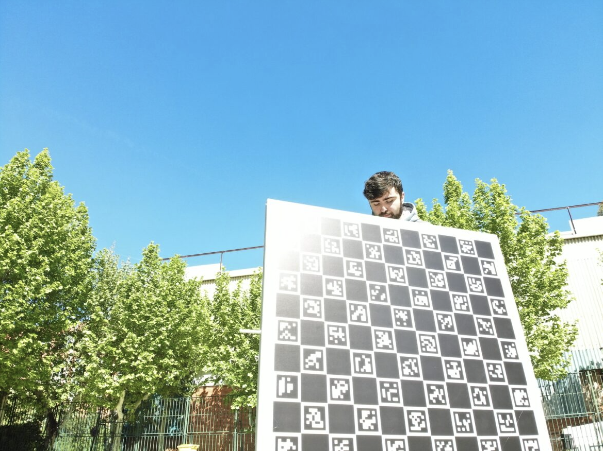
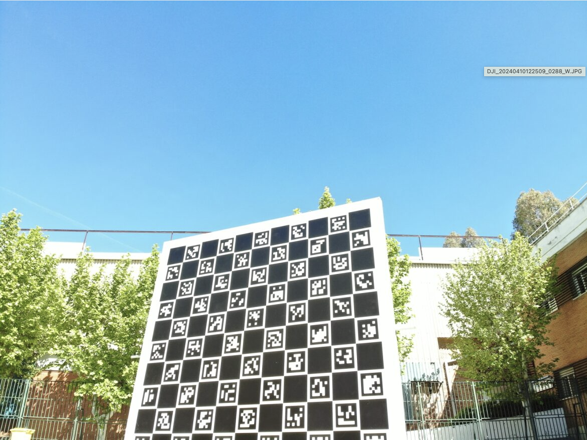
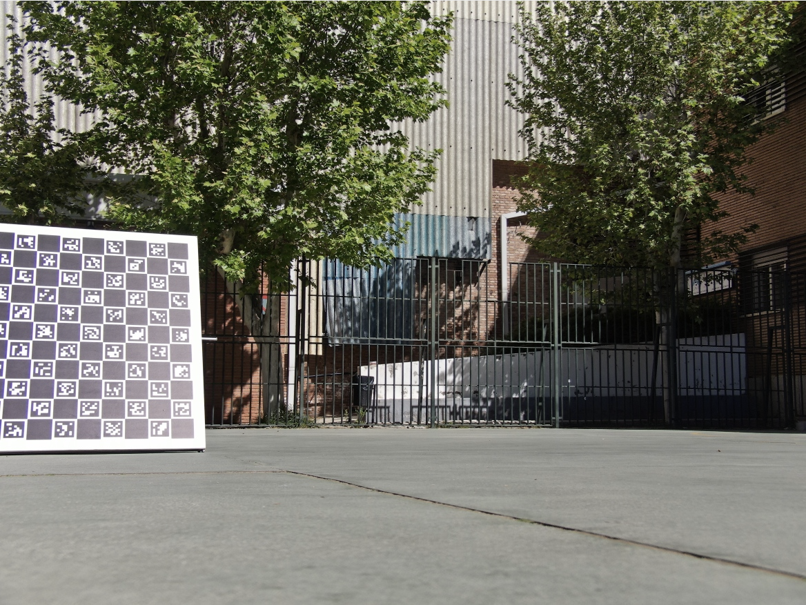

# Camera calibration process with Charucos

## Important to take images
- The images should be taken in the same format and resolution as in the application where they are going to be used.
- The panel should cover many distances with respect to the camera. From distances where the panel occupies a small part of the image to distances where just a part of the panel is visible in the camera.
- The panel should be tilted in every direction, to the front (up, down), to the side (left, right) and in diagonal.
- For every distance and tilted direction, the panel should be moved around the whole image plane.
- If an IR camera is being calibrated, the panel should be "warm" enough by the sun for the Charucos to be seen.


For the calibration example, we took around 1000 images in total. Some images examples:








## Use OpenCV to calibration camera

Here a code example to calibrate:

```
from calibration.calibrator import CharucoCalibrator
import argparse
import cv2
import numpy as np
import json
from pathlib import Path
import os

def options():

    parser = argparse.ArgumentParser(description='Calibrate camera using a video file.') 
    parser.add_argument('--src_path' , type=str, help='Path to calibration images.')
    parser.add_argument('--frame_skip' , type=int, help='Number of frames to skip.')
    parser.add_argument('--min_num_corners', type=int, help='Minimum number of corners to detect.', default = 7)

    opt = parser.parse_args()
    print(opt)
    return opt

def load_images(path, frame_skip):
    images = [] 
    i = 1
    for im in os.listdir(path):
        if frame_skip == 0:
            frame = cv2.imread(os.path.join(path, im))
            images.append(frame)
        elif frame_skip > 0: 
            if i % frame_skip == 0: 
                frame = cv2.imread(os.path.join(path, im))
                images.append(frame)
        i += 1
    return images 

def load_args(path):

    with open(path, 'r') as f:
        args = json.load(f)

    opt = argparse.Namespace(**args)

    return opt

def get_sharpening_kernel(size):

    kernel = np.zeros((size,size))
    kernel += -1
    kernel[size//2, size//2] = size**2 
    return kernel

def preprocess_ir_frame(img):
    img = 255 - img
    sharpen_kernel = get_sharpening_kernel(7) 
    img = cv2.filter2D(img, -1, sharpen_kernel)
    img = cv2.GaussianBlur(img, (3,3), 5)
    return img 

def preprocess_frame(img):
    # return preprocess_ir_frame(img)
    return img

def main():

    opt = options()

    frames = load_images(opt.src_path, opt.frame_skip)

    frames = list(map(lambda x: preprocess_frame(x), frames))

    if len(frames) == 0:
        print('No frames to calibrate with.')
        return

    calibrator = CharucoCalibrator(opt.min_num_corners)

    matrix, dist_coefs = calibrator.calibrate_charuco(frames)

    if matrix is not None:

        params = {
            'camera_matrix': matrix.tolist(),
            'distortion_coefs': dist_coefs.tolist()
         }

        np.savetxt('camera_matrix_h20t01-w.txt', matrix)
        np.savetxt('distortion_coefs_h20t01-w.txt', dist_coefs)

        print(json.dumps(params, indent=4))
    else:

        print('Calibration failed.')


if __name__ == '__main__':
    main()
```

Here the code of `calibrator.py`:

```
import cv2
import numpy as numpy
import os
import numpy as np
from tqdm import tqdm


class CharucoCalibrator:

    def __init__(self, num_corners_th):
        self.num_corners_th = num_corners_th
        self.dictionary = cv2.aruco.getPredefinedDictionary(cv2.aruco.DICT_6X6_250)
        self.board = cv2.aruco.CharucoBoard((11,11),.1,.08,self.dictionary)
    
    def find_charucos(self, images):
        
        corner_coords , id_list = [], []
        print("Detecting charucos in images")
        for i in tqdm(images):

            cpy = i.copy()
            gray = cv2.cvtColor(i, cv2.COLOR_BGR2GRAY)
            cor, ids, rejected = cv2.aruco.detectMarkers(gray, self.dictionary)

            if len(cor) > self.num_corners_th:
                ret, corners, ids = cv2.aruco.interpolateCornersCharuco(cor, ids, gray, self.board)
                if ret > self.num_corners_th:
                    corner_coords.append(corners)
                    id_list.append(ids)

        return corner_coords, id_list

    def calibrate_charuco(self, images):

        corners, ids = self.find_charucos(images)

        size = images[0].shape[0:2]


        cameraMatrixInit = np.array([[ 1,    0., size[0]/2.],
                                 [    0., 1, size[1]/2.],
                                 [    0.,    0.,           1.]])

        flags = (cv2.CALIB_USE_INTRINSIC_GUESS + cv2.CALIB_RATIONAL_MODEL + cv2.CALIB_FIX_ASPECT_RATIO)
        # flags = (cv2.CALIB_RATIONAL_MODEL + cv2.CALIB_FIX_ASPECT_RATIO)

        ret, mtx, dist, rvecs, tvecs = cv2.aruco.calibrateCameraCharuco(corners, ids, self.board, size, cameraMatrixInit, None, flags=flags)

        return mtx, dist
    
    def read_chessboard(self, images):
        allCorners = []
        allIds = []
        decimator = 0
        criteria = (cv2.TERM_CRITERIA_EPS + cv2.TERM_CRITERIA_MAX_ITER, 100, 0.00001)
        
        for im in images:
            gray = cv2.cvtColor(im, cv2.COLOR_BGR2GRAY)

            corners, ids, rejectedImgPoints = cv2.aruco.detectMarkers(gray, self.dictionary)

            if len(corners)>0:
                res2 = cv2.aruco.interpolateCornersCharuco(corners,ids,gray,self.board)
                if res2[1] is not None and res2[2] is not None and len(res2[1])>6:
                    allCorners.append(res2[1])
                    allIds.append(res2[2])

                decimator += 1

        imsize = gray.shape
        return allCorners,allIds,imsize

    def calibrate(self, images):

        corners, ids, size = self.read_chessboard(images)

        cameraMatrixInit = np.array([[ 1000.,    0., size[0]/2.],
                                 [    0., 1000., size[1]/2.],
                                 [    0.,    0.,           1.]])

        # distCoeffsInit = np.zeros((5,1))
        flags = (cv2.CALIB_USE_INTRINSIC_GUESS + cv2.CALIB_RATIONAL_MODEL + cv2.CALIB_FIX_ASPECT_RATIO)
        # flags = (cv2.CALIB_RATIONAL_MODEL + cv2.CALIB_FIX_ASPECT_RATIO)

        (ret, cam_mtx, dist_coef, rot_vec, trans_vec,
         std_dev_int, std_dev_ext, per_point_err) = cv2.aruco.calibrateCameraCharucoExtended(
                charucoCorners= corners, 
                charucoIds= ids, 
                board= self.board,
                imageSize= size,
                # cameraMatrix= cameraMatrixInit,
                # distCoeffs= distCoeffsInit,
                flags= flags,
                criteria= (cv2.TERM_CRITERIA_EPS & cv2.TERM_CRITERIA_COUNT, 10000, 1e-9)
            )
       
        return cam_mtx, dist_coef


    def detect_charucos(self, image):

        img = image.copy()

        if len(image.shape) == 3 and image.shape[2] == 3:
            img = cv2.cvtColor(img, cv2.COLOR_BGR2GRAY)

        cor, ids, rejected = cv2.aruco.detectMarkers(img, self.dictionary)

        return cor, ids, rejected
    
class FishEyeCalibrator(CharucoCalibrator):

    def __init__(self, num_corners_th):
        super().__init__(num_corners_th)

    def calibrate(self, images):

        corners, ids, size = self.read_chessboard(images)

        cameraMatrixInit = np.array([[ 1000.,    0., size[0]/2.],
                                 [    0., 1000., size[1]/2.],
                                 [    0.,    0.,           1.]])

        distCoeffsInit = np.zeros((5,1))
        flags = (cv2.CALIB_USE_INTRINSIC_GUESS + cv2.CALIB_RATIONAL_MODEL + cv2.CALIB_FIX_ASPECT_RATIO)
        # flags = (cv2.CALIB_RATIONAL_MODEL + cv2.CALIB_FIX_ASPECT_RATIO)


        (ret, cam_mtx, dist_coef, rot_vec, trans_vec,
         std_dev_int, std_dev_ext, per_point_err) = cv2.aruco.calibrateCameraCharucoExtended(
                charucoCorners= corners, 
                charucoIds= ids, 
                board= self.board,
                imageSize= size,
                cameraMatrix= cameraMatrixInit,
                distCoeffs= distCoeffsInit,
                flags= flags,
                criteria= (cv2.TERM_CRITERIA_EPS & cv2.TERM_CRITERIA_COUNT, 10000, 1e-9)
            )
       
        return cam_mtx, dist_coef
```
Mind that the panel type is configured with 
```
self.dictionary = cv2.aruco.getPredefinedDictionary(cv2.aruco.DICT_6X6_250)
self.board = cv2.aruco.CharucoBoard((11,11),.1,.08,self.dictionary)
```
